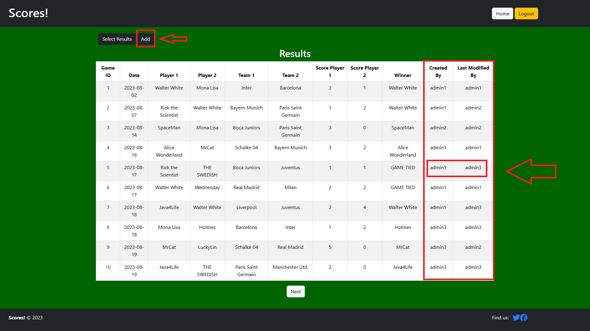
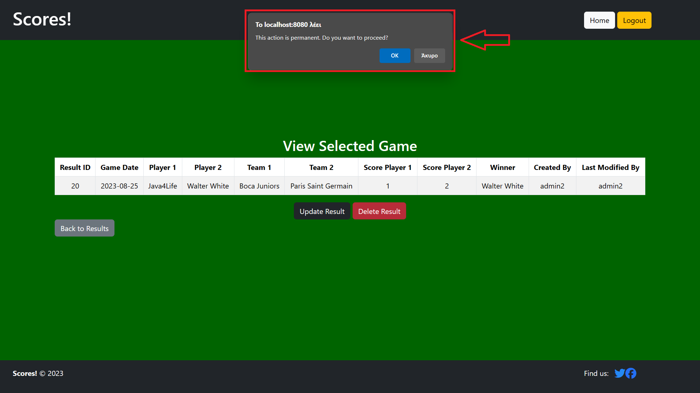

# Scores! 🚀⚽

Final project for AUEB Coding Factory.


Management and results monitoring application for local FIFA tournaments. Useful for both players and tournament administrators. Simple, intuitive, with admin features.

<!-- #################### TECHNOLOGIES #################### -->
## Technologies 🔧

* Java - Spring Boot
* Thymeleaf template engine
* MySQL database


<!-- #################### USAGE #################### -->
## Usage 👤

<!-- Home screen -->
### Home screen

Landing page with 3-button choice menu between players, teams, and results.


<!-- Log in -->
### Log in


<!-- Players -->
### Players

##### Player list

All players of the tournament with pagination. Each player's name is clickable. Each players has an associated name and picture. 


##### Selected player

View results regarding a player. Can be accessed either by a dedicated button with a dropdown list or by clicking on a player.


##### Player stats

View meta-information regarding a certain player, like their win rate.


##### Ranking

Player ranking in the tournament. Win = 3 points, Loss = 0 points, Draw = 1 point.


<!-- Teams -->
### Teams

##### Team list

All teams picked by players. Each team name is clickable.


##### Selected team

Team summary. Information, titles.Can be accessed either by a dedicated button with a dropdown list or by clicking on a team.


<!-- Results -->
### Results

##### Results list

What every player wants to see! All games in a list and their results.


##### Selected result

A page with a single result, mostly to be used for social media screenshots! Can be accessed either by a dedicated button with a dropdown list or by clicking on a result ID.


<!-- #################### ADMIN USAGE #################### -->
## Admin usage 🛡️

Selected actions can only be performed by administrators, i.e., the tournament managers. These actions include

### Player add/update/delete

* Add

    
    

* Update
    
    
    

* Delete (with confirmation)
    

### Team add/update/delete

* Add
    
    

* Update
     
     

* Delete (with confirmation)
    

### Results add/update/delete/auditing

* Add / Auditing
    
    
* Update
     
     

* Delete (with confirmation)
     


<!-- #################### MISC SCREENS #################### -->
## Misc screens 💡

##### No players/teams/results screen

What is shown to the user/admin when no players/teams/results are in the database.
The message change for each entity. (in the image, its for players.)
* User
    
* Admin
     

##### 404

What is shown when someone is trying to be smart but fails.


##### Insertion failed

Not sure how you got to this screen. But something went really wrong!


<!-- #################### DEVELOPMENT GUIDE #################### -->
## Development guide 👨‍💻

Development took place using Intellij and Java 11.

Website can be accessed at `localhost:8080`

### Database initialization

Tested with MySQL 8.0.35.

```
CREATE TABLE players (
    player_id INT AUTO_INCREMENT PRIMARY KEY,
    player_name VARCHAR(255) NOT NULL,
    player_photo LONGBLOB
);

CREATE TABLE teams (
    team_id INT AUTO_INCREMENT PRIMARY KEY,
    team_name VARCHAR(255) NOT NULL,
    team_photo LONGBLOB,
    summary  VARCHAR(1500)
);

CREATE TABLE gameresults (
    result_id INT AUTO_INCREMENT PRIMARY KEY,
    gamedate DATE,
    player1_id INT,
    player2_id INT,
    team1_id INT,
    team2_id INT,
    score_player1 INT,
    score_player2 INT,
    winner_player_id INT,
    loser_player_id INT,
    winning_team_id INT,
    losing_team_id INT,
    FOREIGN KEY (player1_id) REFERENCES players(player_id),
    FOREIGN KEY (player2_id) REFERENCES players(player_id),
    FOREIGN KEY (team1_id) REFERENCES teams(team_id),
    FOREIGN KEY (team2_id) REFERENCES teams(team_id),
    FOREIGN KEY (winner_player_id) REFERENCES players(player_id),
    FOREIGN KEY (loser_player_id) REFERENCES players(player_id),
    FOREIGN KEY (winning_team_id) REFERENCES teams(team_id),
    FOREIGN KEY (losing_team_id) REFERENCES teams(team_id)
);
```

### Admin accounts

Declare in `SecurityConfig.java`

